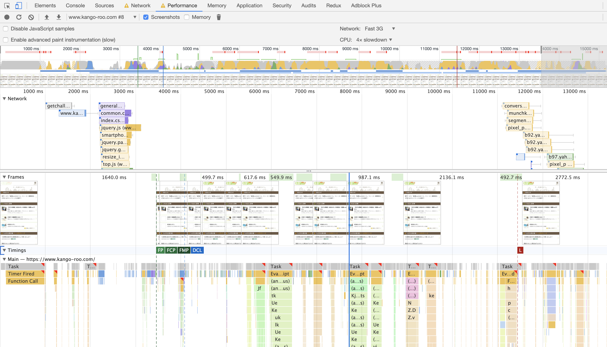

# Webページの速度の話

---

浅く速さの話


---

## なぜ遅いとダメなのか

|||


https://www.thinkwithgoogle.com/marketing-resources/data-measurement/mobile-page-speed-new-industry-benchmarks/  

---

## 速くする

---

### そもそもブラウザの処理

HTTPやTCP、networkについては話しません

|||

|Client|Server|指標|
|:---|:---:|:---:|
|HTTP Request| |↑|
| |Responseを返す|TTFB|
|Responseの最初の部分を受け取る| |↓|
|HTML 解析||
|resourceのDL||
|contentsの表示||

|||

TTFB (Time To First Byte)  
200ms 未満推奨  
3Gで 600ms

|||

#### レンダリングブロックとは

```html
<html>
<title>Title</title>
<link rel="stylesheet" type="text/css" href="style.css"> 
<!--render blocking-->
<!-- ここでcss file を取得、解析するまで rendering, scriptが実行されない-->
<script src="bundle.js"/>
<!--parser blocking (投機的に実行されるSpeculative execution, document.writeなどを使うと破棄される)-->
<!-- ここでjs file を取得、実行が終わるまで下のコードは実行されない -->
<h1>Content</h1>
</html>
```

---

### 速いとは何か

- FP (First Paint)
白い画面の状態）から、Web ページの何らかが表示され始めたタイミング

- FCP (First Contentful Paint)
  コンテンツが表示され始めたとき
  FCP と FP の違いは
  - FP はとにかく何らかビジュアル上の変化が最初に起きたとき成立しうるのに対して
  - FCP はコンテンツになりうるテキストや画像が最初に表示されたとき成立します。

|||

- FMP (First Meaningful Paint) 
  ユーザーがページの主要コンテンツが表示されたと認識するタイミング

- TTI ( Time to Interactive ) — ユーザーの操作に応答できるようになったとき

- Speed Index 
  ページの表示部分が表示される平均時間。
  これはミリ秒単位で表され、ビューポートのサイズに依存します。
  ページコンテンツが視覚的に表示される速度を測定します（数値が小さいほど良い）。
  
|||

### そもそも全てのコンテンツを最初に表示する必要があるのか？

- CRP(Critical Rendering Path)の最適化をする。


|||


|||



---

## css編

---

### selector

```css
li a .hoge {
  color: red;
}
```

|||

*原則右から読む

1. .hoge を全てからのDOM要素から探す(*cacheされている)
1. 親に a があるか
1. liがあるか

*例外css selectorの左が端がid(e.g.`#hoge`)かつ同じidを２つ以上使っていなかった場合  

*id, class , tagはcacheされている

|||

- BEM
- css modules
- css in js

---

## animation

|||

ほとんどの端末60fps

1秒 / 60 = 16.66 ミリ秒  

ブラウザのことも考えると  

実際は10 ms以内に完了する必要がある

|||

自分の端末でスムーズに動くから大丈夫？  
全てのユーザがいい端末を使っているわけではない

|||

 

|||

### Style
CSS ルールがどの要素に一致するかを、マッチング セレクタなどに基づいて見つけ出す

|||

### Layout
どのくらいのスペースが必要か、画面のどこにあるか、などを計算

|||

### Paint:
ピクセルを書き込む処理  
テキスト、色、イメージ、線、影など、実質上、要素の視覚的なすべての描画が行われる。
描画はレイヤーと呼ばれる複数の面で行わる。

|||

### Composite
複数のレイヤーに描かれているものを、正しい順序で画面に描画する

|||

## Layoutを伴うプロパティを変更した場合


|||

## Paintのみのプロパティを変更した場合


|||

## LayoutもPaintも必要としないプロパティを変更した場合


|||

今の
Compositor-Only Propertiesは
transforms と opacityのみ

|||

<iframe src="https://csstriggers.com/" style="width:100%;height:80vh;">

[url](https://csstriggers.com/)

|||

- Blink
  - chrome
  - edgeのこれから
- Gecko
  - firefox
- Webkit
  - safari
- EdgeHTML
  - edge
  - さよなら

|||

- 要素を移動させるときはtransformを使う
- will-change とかも知っていると良さそう
- layerを増やしすぎないよう注意( position )


